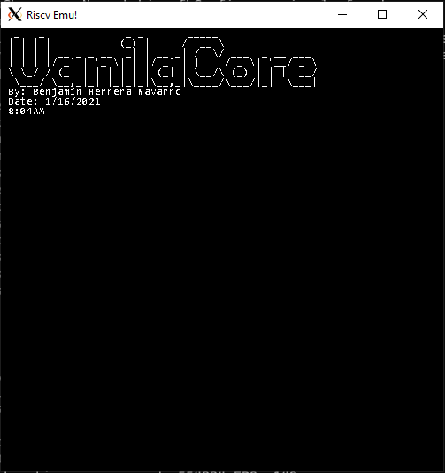
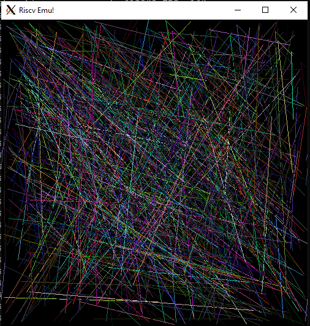

# riscv-emu
RISCV RV32I emulator written in C++ and using SMFL for handling the window. The emulator support the RV32I ISA extention and the M-Mode Privilege mode with timer interrupt support. Memory Protection Register are not implemented.

The performance of the emulator got really good. Now it can execute up-to 15MIPS on an i7 10750H Mobile CPU. At close to 200FPS.

### Goals

One of the goals of this program is to have a TUI and a GUI. To which interface with it. But most importantly is to support the while privilege spec. Currently progress is being made into the TUI and GUI part of it.

- <s>Machine Mode</s>
- <s>ELF File Support</s>
- Supervirory Mode
- User Mode
- TUI <= In progress
- GUI <= In progress
- ELF File support
- Tracing function calls <= In progress (Basic Support implemented)

## Dependecies
```
sudo apt-get update
sudo apt-get install g++
sudo apt-get install libsfml-dev
```
## RISC-V Toolchain
RISCV Toolchain in order to compile the tests
```
sudo apt-get install autoconf automake autotools-dev curl python3 libmpc-dev libmpfr-dev libgmp-dev gawk build-essential bison flex texinfo gperf libtool patchutils bc zlib1g-dev libexpat-dev
git clone --recursive https://github.com/riscv/riscv-gnu-toolchain
./configure --prefix=/opt/riscv --enable-multilib
make -j$(nproc)
```


## Compile & Test
```
  make test
```

## Debug
The debug.h file contains macros that activate features of the emulator if defined. When `__TRACING__` is enabled, the emulator will print every instruction executed.
If `__DEBUG__` is enabled, the emulator will print every bus read and writes into the terminal. Finally when `__INS_COUNT__` is defined, the emulator will print on each 
second the number of instruction executed per second.
```c
#define __DEBUG__
#define __TRACING__
#define __INS_COUNT__
```

## Preview
<div>
  <p align="center">
     </img>    
     </img>    
  </p> 
</div>

### RISCV Code
The code that the emulator will be executing is on crt0.s, timer.s and test.c which includes the main function and exeption handler written in C.

### Known Issues.
The timer interrupts are not synchronized correctly yet. 
